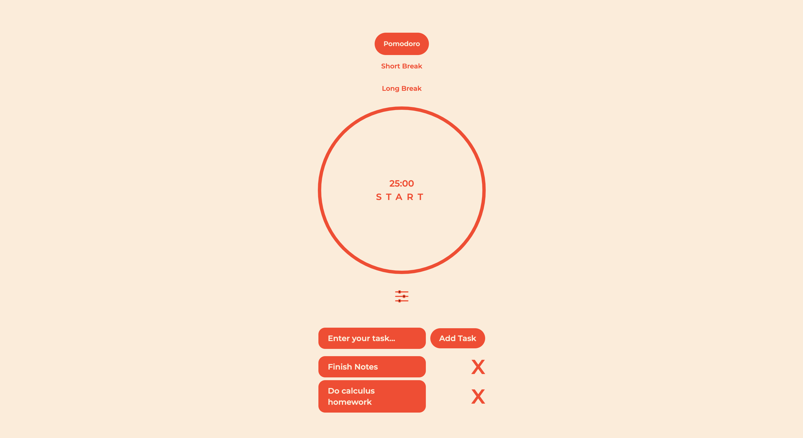

# Pomodoro Timer

## Table of Contents
- [Introduction](#introduction)
- [Features](#features)
- [Getting Started](#getting-started)
- [Customization](#customization)
- [Technologies Used](#technologies-used)
- [Contributing](#contributing)
- [License](#license)

## Introduction

Welcome to the Pomodoro Timer! This simple and efficient timer is designed to help you manage your work or study sessions effectively using the Pomodoro Technique. The Pomodoro Technique is a time management method that breaks your work into focused intervals (typically 25 minutes), followed by short breaks (5 minutes) and longer breaks (15 minutes) after a set number of work intervals.

Use this Pomodoro Timer to boost your productivity and stay on top of your tasks while maintaining a healthy work-life balance.

## Features

- **Pomodoro Time (25 minutes)**: Focus on your task for a 25-minute work session.
- **Short Break (5 minutes)**: Take a quick 5-minute break to relax and recharge.
- **Long Break (15 minutes)**: Enjoy a longer 15-minute break after completing a set of work intervals.
- **Customizable Time Settings**: Adjust the Pomodoro, short break, and long break durations according to your preferences.
- **Current Task Feature**: Enter and track your current tasks, ensuring you stay organized and on track.

## Getting Started

To get started with the Pomodoro Timer, follow these steps:

1. Clone this repository to your local machine.
git clone https://github.com/your-username/pomodoro-timer.git

3. Navigate to the project directory.
cd pomodoro-timer

5. Install the required dependencies.
npm install

7. Start the development server.
npm run dev

## Customization
You can customize the time settings of the Pomodoro Timer to suit your preferences. Follow these steps to make changes:

1. Open the settings menu by clicking the settings icon below the timer.
2. Adjust the duration of the Pomodoro, Short Break, and Long Break.
3. Click the "Apply" button to apply your changes.

## Technologies Used
This Pomodoro Timer was created using the following technologies:

- **React.js:** A JavaScript library for building user interfaces.
- **Tailwind CSS:** A utility-first CSS framework for building stylish and responsive web designs.
- **Node.js:** A JavaScript runtime environment for server-side applications.
- **Vite:** A fast-build tool and development server for modern web apps.

## Contributing
We welcome contributions from the community. If you'd like to contribute to the development of this Pomodoro Timer please feel welcome to.

## License
This project is licensed under the MIT License - see the LICENSE file for details.

Happy productivity! 🍅💪
